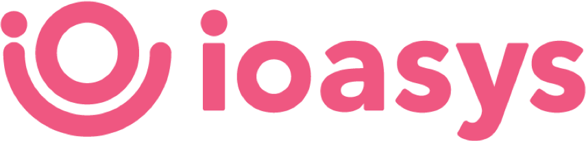

<!-- # Empresas Web


> Teste técnico para vaga de Desenvolvedor Frontend React. :clipboard: -->


<div align="center">
    
</div>

<h1 align="left">Enterprises</h1>

<p align="left">
   <a href="https://github.com/danieljpgo">
      
   </a>
   
   <a href="https://github.com/danieljpgo/enterprises/graphs/contributors">
      
   </a>
    <a href="https://github.com/danieljpgo/enterprises/network/members">
      
   </a>
   
   
</p>

> todo

&nbsp;

<p align="center">
   <a href="#project">Project</a>&nbsp;&nbsp;&nbsp;|&nbsp;&nbsp;&nbsp;
   <a href="#goals">Goals</a>&nbsp;&nbsp;&nbsp;|&nbsp;&nbsp;&nbsp;
   <a href="#features">Features</a>&nbsp;&nbsp;&nbsp;|&nbsp;&nbsp;&nbsp;
   <a href="#technologies">Technologies</a>&nbsp;&nbsp;&nbsp;|&nbsp;&nbsp;&nbsp;
   <a href="#getting-started">Getting Started</a>&nbsp;&nbsp;&nbsp;|&nbsp;&nbsp;&nbsp;
   <a href="#license">License</a>
</p>

<div align="center">
   <!--  -->
</div>

## Project

TODO

## Goals

The goals of this project were:
- TODO

## Features

The main features of the project are:
- TODO

## Technologies

The main technologies used to develop the project were:

- [React](https://reactjs.org/)
- [Yup](https://github.com/jquense/yup/)
- [SWR](https://swr.vercel.app/)
- [Formik](https://formik.org/)
- [Storybook](https://storybook.js.org/)
- [Framer Motion](https://www.framer.com/motion/)
- [Testing Library](https://testing-library.com/)
- [Styled Component](https://styled-components.com/)

This project was bootstrapped with:

- [create-react-app](https://github.com/facebook/create-react-app)


## Getting Started

First of all, you may clone this project:

```
git clone https://github.com/danieljpgo/enterprises.git
```

Run the following scripts in order to execute the application:

```
// install dependencies
yarn install

// start the application
yarn start
```

To run the tests:

```
yarn test
```

To run the Storybook:

```
yarn storybook
```

## License

This project is under the [MIT license](https://github.com/danieljpgo/enterprises/blob/master/LICENSE).

<div>Released in 2020.</div>

Make with ❤️ by [Daniel Jorge](https://github.com/danieljpgo)
